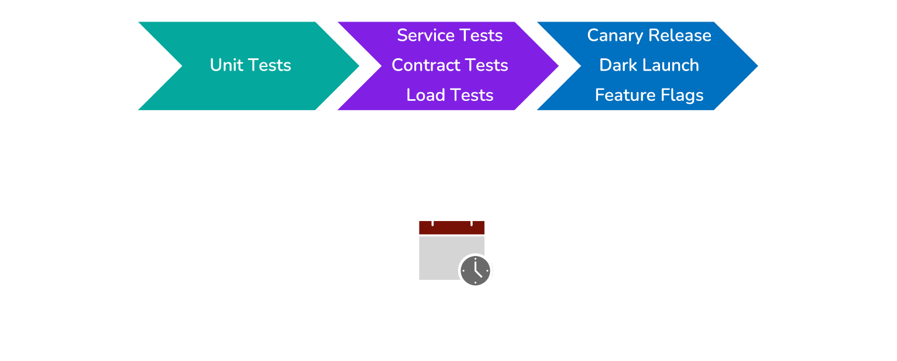

# Challenges Testing Microservices

## Automated Testing

Automated software tests are broadly grouped into three categories:

- **Unit Tests** - Test individual components of a program.
  The subject under test is a single function, class, or some other unit of non-trivial programming logic.
- **Integration Tests** - Test that multiple logical components of the system function correctly together.
- **End-to-End Tests (E2E)** - Exercise full-system workflows as they would occur in the live application.

While each type of test serves a unique purpose and has a place in a well-balanced test suite, they all aim to increase developers' confidence that their application will work as expected in the real world.
A pyramid is often used to illustrate how each type of test relates to the others.

Tests which are higher on the pyramid have a broader scope and provide more confidence that the system works correctly.
However, broadly scoped tests take longer to run, and do less to pinpoint the exact cause of a failure.

In contrast, tests that are lower on the pyramid execute more quickly and provide better isolation of bugs.
However, these tests provide less confidence that the application works correctly as a whole.

Most applications use a mixture of different forms of testing and typically use specific kinds of tests at different stages of continuous integration/continuous delivery (CI/CD).
Tests are sequenced in order to catch regressions as **early as possible**, and gradually ramp up in scope as confidence increases that everything is working as it should.
This means that unit tests are typically run first, followed by in-process integration tests, after which the application may be deployed in a staging environment for additional integration and E2E testing.

Since tests that are high on the pyramid provide the most confidence in the quality of the app, ideally they can be run as often as possible.
However, since they also tend to be expensive and take a long time, this desire for more quality assurance must be balanced with the value of deploying updates more quickly.
The longer it takes to progress through CI/CD, the longer it takes for users to see new features and bug fixes.

This is another area of strength for monolithic applications.
Since much of the applications's complexity is pushed into the code rather than the underlying infrastructure, broadly scoped tests still tend to be reasonably fast and cheap.
In fact, it is common to run E2E tests every time a new version of a monolith will be deployed.

Microservices are a different story.
Carrying out broadly scoped tests on a distributed system requires overcoming additional challenges that do not arise when testing monoliths.
Some of these challenges have to do with integration testing in general, while others have to do specifically with E2E tests.
We will consider both areas.

### Challenges with Integration Testing

At this point, it is worth noting that the term "integration test" has multiple meanings depending on whom you talk to.
In one sense, it is used as an umbrella term for anything more broad than a unit test.
At other times, it refers to testing a small subset of components, but not the entire application (so, excluding E2E tests).
For the remainder of this case study, we use the term "integration test" to mean any test that requires deploying and running more than one service.

Integration tests are more complicated to implement for microservices because they do not neatly satisfy the ideals of limited ownership. In order for one team to perform integration tests with another team's service, they may need help with a number of things:

- Knowing which version (or versions) of the other service are currently released,
- Setting up the other service's runtime environment, configuring the service, and starting it up in the correct way, and
- Setting up and configuring the other service's external dependencies (this might require getting additional teams involved as well).

To address the limited ownership problem, integration tests can be supplemented with **service tests**, where the external service is replaced with a *test double*.
The **test double** receives requests from the service being tested and sends back a canned response, enabling a team to test the integration of their service with another, without actually spinning up the other service.
This lowers the costs of integration testing and speeds up the developer feedback loop.

However, service tests only work as long as the real external service's interface does not drift from that of the test double; if the real service changes, the test double needs to be updated as well.
Ideally, there should be an *automated* way to validate that the test double is up to date with the real service it represents.

### Challenges with E2E testing

Conducting integration tests on microservices becomes more difficult as the scope of the test expands. E2E tests are a huge pain point, and we will look at three reasons why they are more troublesome in this context than they are with monoliths.

First, E2E testing requires simulating production conditions as closely as possible in a dedicated testing environment.
This is incredibly challenging with a large number of services, as it requires one or more instances of every service in the application to be spun up in the environment.
Not only is this **expensive**, it also becomes increasingly **difficult to accomplish** as the architecture grows.
In practice, E2E testing may require *multiple* testing environments so that different teams can conduct tests on new versions of their service at the same time.

The second challenge is that **E2E tests are slow**.
They usually consist of consecutive user interactions and may execute synchronously to ensure repeatability and consistency of state across different test runs.
E2E tests are especially slow for microservices because services interact through network calls, which are orders of magnitude slower than reading from memory.

> "I have seen \[E2E tests\] take up to a day to run, if not longer, and on one project I worked on, a full regression suite took six weeks!"[^1]

As discussed previously, slow test suites decrease the rate at which updates can be released.
They also slow down the developer feedback loop, making it more costly to fix a bug and start the CI/CD process over again.

Finally, **E2E tests tend to be flaky**, meaning that they may fail even when there is nothing wrong with the code being tested.
A classic indicator of this is when back-to-back test runs yield different results, even when the code has not changed.
Inconsistent test results can be caused by network faults, third-party services being unavailable, and application state being set up or torn down incorrectly between tests.

> "Non-deterministic tests have two problems, firstly they are useless, secondly they are a virulent infection that can completely ruin your entire test suite."[^2]

Flaky tests not only provide little value when they fail, but they also erode developer's trust in the test suite and promote a culture where it is acceptable to ignore failing tests.

## Microservices Still Need Broadly Scoped Tests

Despite the difficulties that broadly scoped tests pose for microservices, this type of architecture also has more to gain from them.
This is because API calls over the network are more complex and significantly less reliable than in-memory method calls.
Another factor is that microservices are more likely to be built by multiple teams, and broadly scoped tests serve as confirmation that teams correctly understand each other.

Therefore we are faced with a dilemma — microservices clearly need broadly scoped tests.
However, they cannot be implemented in the same manner as is typically done for monoliths.
Doing so can degrade the unique benefits that make microservices a desirable architecture to begin with.

One solution to this dilemma is to use **alternative forms of testing** in CI/CD that catch as many breakages as possible, while still promoting fast feedback and quick deployment cycles.
Using alternative forms of testing together with progressive delivery techniques can provide sufficient confidence during CI/CD so that broadly scoped tests don't need to be run for every deployment.
As a result, integration and E2E tests can be run on a periodic schedule in order to catch the kinds of issues that only they can catch.

Service tests and *contract tests* are two such alternative testing methodologies that lie within the scope of this case study. Since we have already introduced service tests, we will turn our attention to contract tests in the next section.

[^1]: Sam Newman, *Building Microservices* 289 (2nd ed. 2021).
[^2]: Martin Fowler, [Eradicating Non-determinism in Tests](https://martinfowler.com/articles/nonDeterminism.html).
