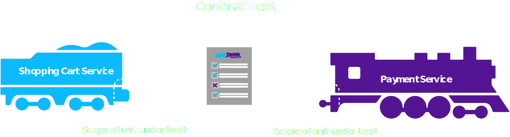
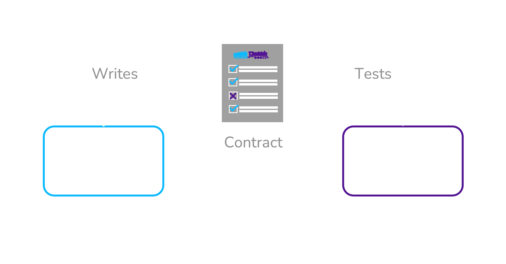
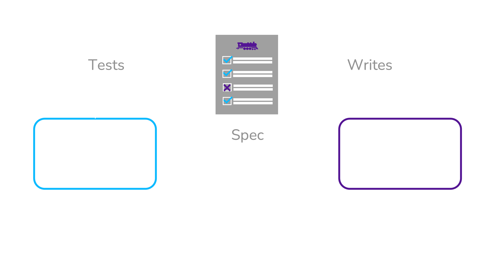
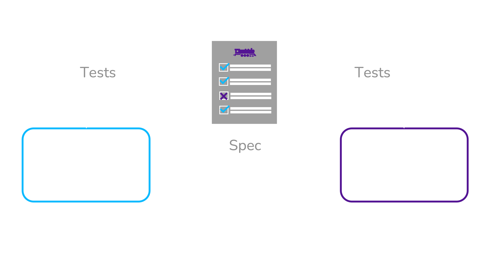

# Contract Testing

Given two services that interact with each other, a **contract test** interrogates each service *in isolation* to see if the two interfaces are compatible with each other.
The test relies on a document known as a **contract** that formally describes the interactions between the services.
It does this by enumerating the HTTP requests and responses that each service expects to send and receive.

```json filename="example_contract.json" {11, 18}
{
  "consumer": {
    "name": "shopping_cart_service"
  },
  "provider": {
    "name": "payment_service"
  },
  "interactions": [
    {
      "description": "a request for the payment with a paymentId of 1",
      "request": {
        "headers": {
          "Accept": "application/json",
        },
        "method": "GET",
        "path": "/payments/1"
      },
      "response": {
        "body": {
          "paymentId": 1,
          "amount": 12.50,
        },
        "headers": {
          "Content-Type": "application/json",
        },
        "status": 200
      }
    }
  ]
}
```

Both services are individually tested to ensure that they conform to the contract.
The test fails if either service does not conform, indicating that the two services will not integrate correctly.



In the context of contract tests, services are classified as either a *provider* or *consumer*.

- **Provider** - A service which exposes some functionality and/or data for other services to use.
- **Consumer** - A service which requires functionality and/or data from another service in order to fulfill its own requirements.

These roles are only meaningful in the context of a single integration between two services.
A service may assume the role of a provider with respect to one service while assuming the role of a consumer with respect to another service.

## Benefits of Contract Testing

Contract tests relieve the burden of having to deploy multiple services together for integration testing.
They build confidence that the services will work correctly together, without requiring both teams to coordinate their testing or know how to run the other team's service.

Not only that, but they also provide much faster feedback than integration and E2E tests.
Contract tests behave more like unit tests or service tests and can be run quickly, cheaply, and early in the CI/CD pipeline.
In fact, they are lightweight enough that a developer could even run them locally as they are working on the codebase.

An added benefit of contract tests is that they isolate bugs with more specificity than most integration and E2E tests.
Because each interaction (*e.g.*, an HTTP request and response pair) is enumerated in the contract, a failing test can report exactly which messages are missing or malformed.

## Limitations of Contract Testing

Contract tests do not eliminate the need for integration and E2E tests.
E2E tests provide a high degree of confidence because they try to mimic production conditions to the greatest extent possible.
Contract tests have a more narrow focus — to test the compatibility of interfaces and catch breaking changes quickly.
Contract tests exclude many production conditions such as latency, service unavailability, and configuration/deployment details.
Ambient factors like these are implicitly tested during E2E testing simply because all of the services are tested together in a staging environment.

Instead, contract tests reduce the *quantity* of broadly scoped tests that are needed in CI/CD and, in some cases, allow integration and E2E tests to be run separately from CI/CD altogether.

Another trade-off to consider is that implementing contract testing may require writing many new tests.
Until there is sufficient coverage of a service's interface, that team cannot be confident that accidental breakages will be caught.

## Evaluating various forms of Contract Testing

There are three general types of contract testing. The main difference between them lies in what exactly is being represented by the contract.

- **Consumer-driven** - The contract represents how the consumer is currently implemented.
- **Provider-driven** - The contract represents how the provider is currently implemented.
- **Spec-driven** - The contract represents how both services *should* be implemented even if neither of them yet conform to that implementation.

### Consumer-driven

In consumer-driven contract testing, the contract represents how the consumer service is currently implemented.
The consumer team writes unit tests that exercise the consumer’s API client code.
Running these tests creates a consumer contract based on the requests that the consumer service makes as well as the responses it successfully handles.
The resulting contract describes the expectations that the consumer service has of the provider service.
The consumer contract is then handed over to the provider team so they can verify the contract against the provider’s API.
The requests in the contract are replayed against the API (a process known as *provider verification*) and the responses from the API are compared with those specified in the contract.
If the provider service sends the correct response for each request, the contract test passes.



A significant advantage of the consumer-driven approach is that the contract describes exactly which parts of the provider API are being used by the consumer.
This gives the provider team insight into how they can evolve their API without breaking any consumers.

On the other hand, the consumer-driven approach also has a major drawback.
It undermines independent deployability for consumer services.
After generating the consumer contract, the consumer team must wait for the provider team to pull down the contract, spin up their service, and verify that it correctly implements the consumer's requirements.
Only if the provider passes verification can the consumer team proceed to deploying their service.
In the event that provider verification fails, either the consumer team must fix the issue and start the process over again, or they must wait for the provider team to update their API to satisfy the contract.

In either case, the provider team must be involved any time the consumer team wants to deploy a new version of their service.
Taking into account that microservices may have multiple external dependencies, consumer-driven contract testing requires significant cross-team coordination — placing a severe limitation on how quickly new software can be deployed.

### Provider-driven

Provider-driven contract testing is nearly the reverse of consumer-driven.
The provider contract is generated based on the current implementation of the provider service.
Usually the provider contract comes in the form of an API specification, other times the provider team distributes a test double which consumers can test against.



The main benefit of a provider-driven approach is that it gives the provider team authority over what the integration looks like.
Whether or not this makes sense depends on the organization and the roles of the services involved.
One situation where this is appropriate is when the provider has a large number of consumers, and it is impractical for the provider team to negotiate their API with all of them at once.

In a provider-driven model, it is less clear whether contract testing will give the provider team insight into how their API is being consumed.
The contract describes what the provider offers, not necessarily how consumers are using it.
Provider-driven solutions commonly support the ability for writing consumer-specific test cases in the provider contract, but this demands substantial additional effort.

### Spec-driven

Spec-driven contract testing occurs when the API spec is defined separately from either service's implementation.
Usually this means that the consumer and provider teams agree on the API spec ahead of time, before either service has implemented it.



This approach flows naturally out of "Spec-first" API design, a practice where the provider team decides on a spec before writing the code, instead of documenting their implementation after it is completed.
This design philosophy is beneficial because it allows both the consumer and provider services to be implemented simultaneously.
As each service finishes implementation, it can be independently tested against the API spec to verify that it will integrate correctly with the other service.

Spec-driven contract testing is the most conducive to independent deployability.
The API spec is decided at the beginning, and both services can be tested against the spec independently.
Neither team needs help from the other to test the integration.
As long as the both teams require every new version of their service to be tested for conformance to the spec, the deployment cycles of the two services can remain decoupled.
