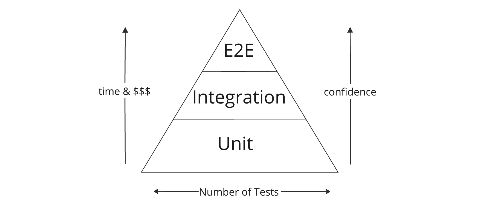

# Challenges Testing Microservices

## Automated Testing

Automated software tests are broadly grouped into three categories:

- **Unit Tests** - Test individual components of a program.
  The subject under test is a single function, class, or some other unit of non-trivial programming logic.
- **Integration Tests** - Test that multiple logical components of the system function correctly together.
- **End-to-End Tests (E2E)** - Exercise full-system workflows as they would occur in the live application.

Each type of test serves a unique purpose and has a place in a well-balanced test suite.
A pyramid is often used to illustrate how each type of test relates to the others.

**TODO: Replace with final diagram**

Tests which are higher on the pyramid have a broader scope and provide more confidence that the system works correctly.
However, broadly-scoped tests take longer to run, and do less to pinpoint the exact cause of a failure.

In contrast, tests that are lower on the pyramid execute more quickly and provide better isolation of bugs.
However, these tests provide less confidence that the application works correctly as a whole.

## Testing Microservices

Compared with monoliths, microservices have more to gain from tests that are high on the pyramid.
This is because API calls over the network are more complex and significantly less reliable than in-memory method calls.
An additional factor is that different microservices may be built by different teams.
Broadly-scoped tests confirm that multiple teams understand each other correctly.

Let us explore an example which illustrates why broadly-scoped tests are so important for microservices.
In order to do that it will be helpful to think about services assuming the role of either a *provider* or a *consumer*.

- **Provider** - a service which exposes some functionality and/or data for other services to use
- **Consumer** - a service which requires functionality and/or data from another service in order to fulfill its own requirements

Microservices should be loosely coupled—one team should not need to know how another team's services are implemented.
Suppose a provider team wants to change their service's API.
If the provider team does not know how the consumer services are implemented, it is easy for them to accidentally change the API in a way that breaks a consumer.

Integration and E2E tests are well-suited to catch this type of error before it is introduced into production.
However, applying broadly-scoped tests to microservices can hinder independent deployability, clear ownership, and rapid development cycles.
In the following section, we will explore why this is the case.

### Challenges with Integration Testing

Independent deployability requires that new versions of a service can be built, deployed, and released with **minimal involvement from other teams**.
However, in order for one team to perform integration tests with another team's service, they may need help with a number of things:

- Knowing which version (or versions) of the other service are currently released
- Setting up the other service's runtime environment, configuring the service, and starting it up in the correct way
- Setting up and configuring the other service's external dependencies (this might require getting additional teams involved as well)

To address this problem, integration tests can be replaced with **service tests**, where the external service is replaced with a *test double*.
The **test double** receives requests from the service being tested and sends back a canned response.
This enables a team to test the integration of their service with another, without actually spinning up the other service.

TODO: Integration vs Service test diagram

However, service tests only work as long as the real provider's interface does not change; if the provider service changes, the test double needs to be updated as well.
Ideally, there should be an automated way to validate that the test double is up to date with the real service it represents.

### Challenges with E2E testing

The difficulties of testing microservices are even greater in the context of E2E testing.
There are many reasons for this, but we will take a look at three in particular.

First, E2E testing requires simulating production conditions as best as possible in a dedicated testing environment.
This is incredibly challenging with a large number of microservices, as it requires one or more instances of every service in the application to be spun up in the environment.
Not only is this **expensive**, it also becomes increasingly **difficult to accomplish** as the architecture grows.

In practice, E2E testing may require *multiple* testing environments so that different teams can conduct tests on new versions of their service at the same time.

The second challenge is that **E2E tests are slow**.
They usually consist of consecutive user interactions and may execute synchronously to ensure repeatability and consistency of state across different test runs.
E2E tests are especially slow for microservices because services interact through network calls, which are orders of magnitude slower than reading from memory.

> "I have seen \[E2E tests\] take up to a day to run, if not longer, and on one project I worked on, a full regression suite took six weeks!"[^1]

Slow E2E test suites decrease the speed at which new features can be shipped because they slow down the developer feedback loop.
If it takes longer for developers to become aware that their changes broke something, it takes longer for them to fix it and start the CI/CD process over again.

Finally, **E2E tests have a tendency to be flaky**, meaning that they may fail even when there is nothing wrong with the code being tested.
A classic indicator of this is when back-to-back test runs yield different results, even when the code has not changed.
Inconsistent test results can be caused by network faults, third-party services being unavailable, and application state being set up or torn down incorrectly between tests.

> "Non-deterministic tests have two problems, firstly they are useless, secondly they are a virulent infection that can completely ruin your entire test suite."[^2]

Flaky tests not only provide little value when they fail, but they also erode developer's trust in the test suite and promote a culture where it is acceptable to ignore failing tests.
Where possible, E2E tests should be replaced with more reliable and maintainable tests that will catch the same kinds of bugs.

## The crux of the matter

We have seen that in order to effectively test microservices, we need ways to increase our confidence that the application works correctly as a whole, without compromising the key benefits that lead us to adopting microservices in the first place.

What we need are testing methodologies that catch the same bugs as integration and E2E tests, while maintaining a high degree of independent deployability and clear boundaries of ownership.
These tests should also be faster, cheaper, and more maintainable than broadly-scoped tests. Contract testing is one such alternative, and it is there that we will turn our attention next.

[^1]: Sam Newman (Building Microservices - pg. 289)
[^2]: Martin Fowler - [Eradicating Non-determinism in Tests](https://martinfowler.com/articles/nonDeterminism.html)
