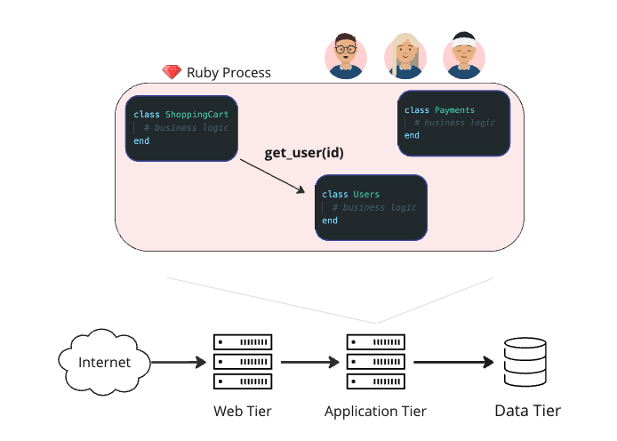
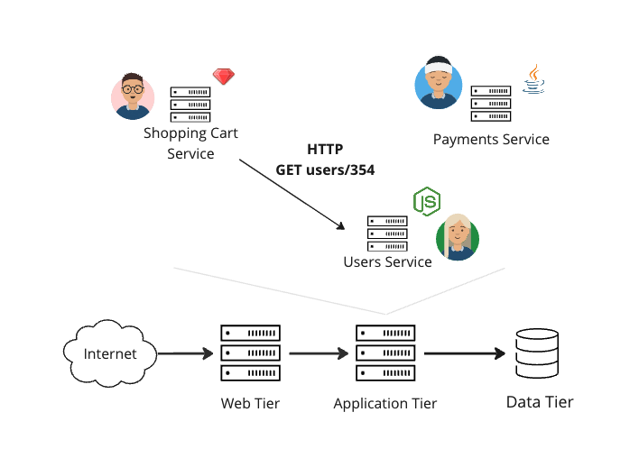

# Of Monoliths and Microservices

Signet addresses specific challenges with **testing applications composed of microservices**.
In order to add color to these challenges, we will begin by discussing relevant trade-offs associated with microservices, especially compared with a more common *monolithic* architecture.

## What is a Monolith?

In a **monolithic architecture**, all of an application's server-side business logic is deployed together as a single unit.
Typically, this means that each business domain is modeled by one or more programming constructs (such as a class, namespace, module, or package) that are stored in a shared repository.
When deployed, the server-side logic runs as a single process.
Each business domain can consume the functionality of other domains through **in-memory method calls**.

Monoliths are a **sensible default architecture** for most web apps, and they are especially suitable if a company is at an early stage of business development.
Such companies tend to be unstable in terms of their business requirements — many adapting significantly before finding their long-term market niche.
Monoliths are more forgiving of this instability because they require less architectural commitment upfront.
Getting started with an architecture style involving many infrastructure components (such as microservices) can be more challenging if the long-term shape of the business is not known with confidence.

A monolithic architecture also allows for a simpler deployment and maintenance.
When all of the business logic is executed as a single process, each instance of the application can be hosted on a single node.
An added benefit of this is that requests can be handled more quickly and reliably when they do not require calls to out-of-process components.

However, monoliths become more challenging to work with as the codebase and number of engineers grows in size.
Working on a large codebase requires an engineer to be familiar with a lot of code and to keep that knowledge in their head as they make changes.
With so much to keep track of, it is easy to change something that unintentionally breaks another part of the codebase.
Unexpected breakages can also occur when different engineers working on different features make changes to the same piece of code.

Although many large organizations find success with a monolith, other architectures exist which offer a different set of trade-offs that are specifically tailored to operating at a large scale.

## What are Microservices?

In a **microservice architecture**, the application is split up into *independently deployable services*. Each service typically represents a single business domain.

A **service** can be thought of as a standalone unit of software that encapsulates its own logic.
A service exposes an interface so that other services or applications can consume its functionality through messages sent over the network.

Well-designed microservice architectures allow large applications to remain highly evolvable *within* each business domain.
While cross-domain changes tend to be more complicated than with monoliths, isolating each area of business functionality into a standalone unit makes it easier to ship new features for a given domain.

One reason for this is an attribute we refer to as **limited ownership**.
Having a network boundary between services creates a natural limit to the scope of each engineering team.
Each team only needs to concern themselves with the implementation details of their own service.
They can use the functionality provided by other services' APIs without worrying about how those services are implemented.
Having a more limited scope of ownership allows each team to ship features in their own business domain more quickly.

Microservice architectures also create the possibility for services to be **independently deployable**.
In a monolith, a change to any part of the codebase requires the entire application to be redeployed.
However, in a microservice architecture, any service should be able to be redeployed without affecting the other services.

Independent deployability is only possible to the extent that business domains are well-defined (so that cross-domain changes are rare), and service's APIs change in ways that are backwards compatible.
As with limited ownership, independent deployability makes it easier for each business domain to evolve quickly, since teams do not need to worry about batching the deployment of their changes with the changes from other teams.

A major trade-off with microservices is that even a single instance of the application becomes a kind of distributed system, creating a host of new challenges.
Communicating with out-of-process components introduces additional latency and unreliability into the system.
In addition, the overall deployment strategy for the application can be more complex.
These challenges make microservices less suitable for applications managed by a small number of engineers, as they gain less from the benefits mentioned above in exchange for this added complexity.
Additionally, getting started with microservices may involve more initial investment in designing the infrastructure than a monolith would require.

## Testing Microservices

Microservices offer potential benefits that must be realized in order to justify the drawbacks of a more complex architecture.
Limited ownership and independent deployability are the most pertinent of these benefits to the discussion that follows.
In the next section, we will examine how *automated testing* can potentially impede these benefits.
We will also discuss the attributes of microservices that suggest a different testing strategy than what is normally used for testing monoliths.
