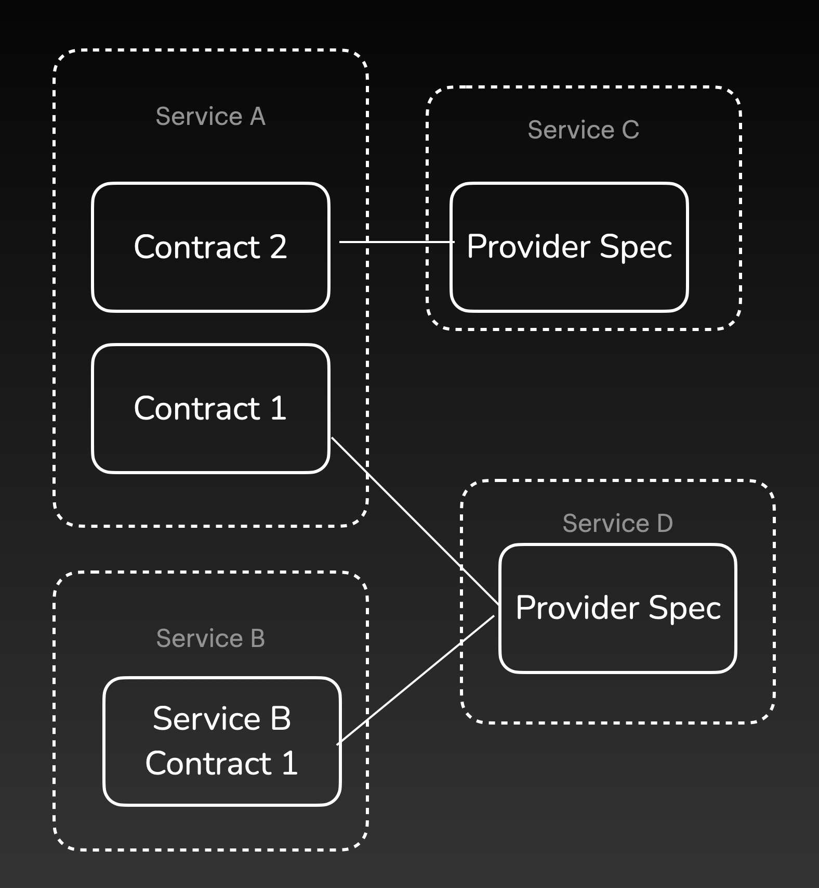
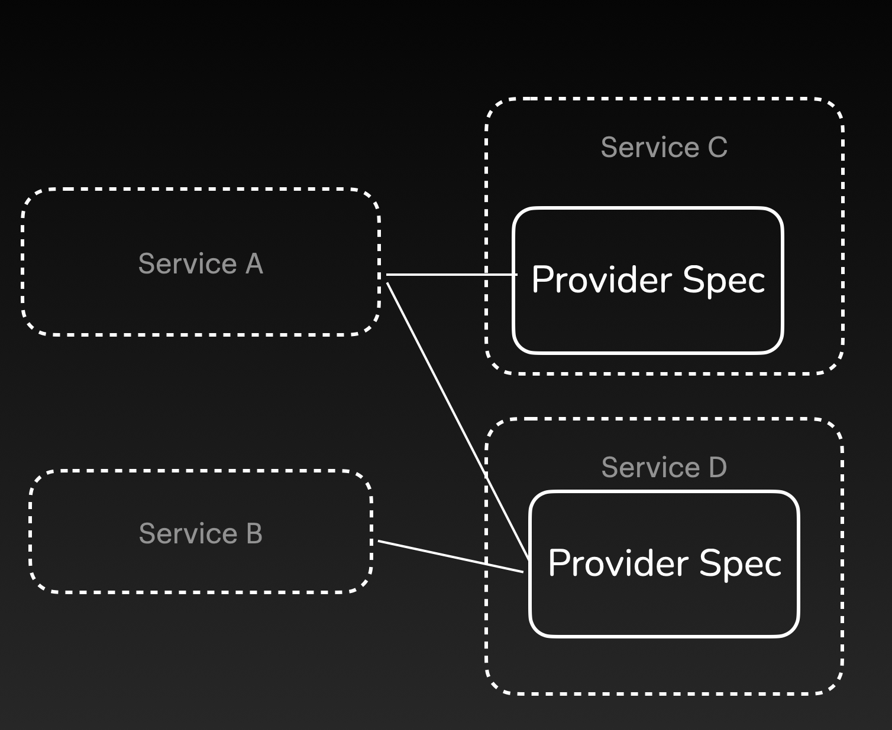
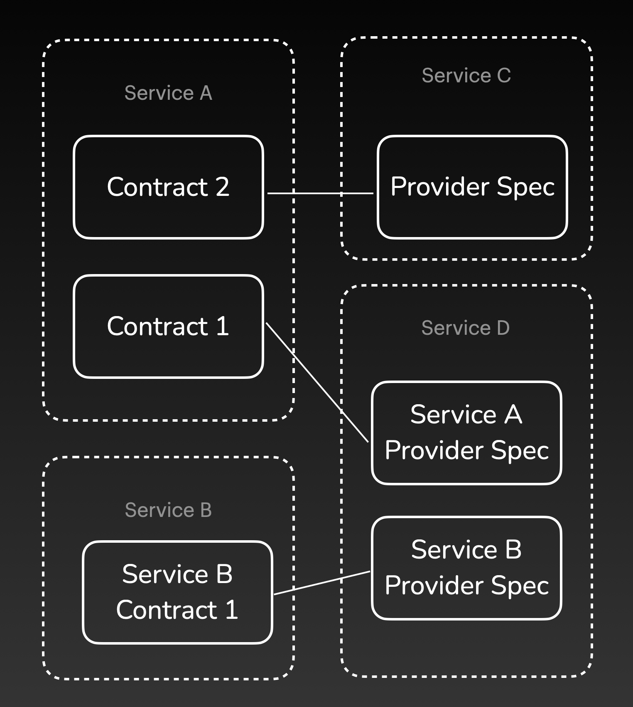

# Contract Cardinality

## Signet's Model

Signet requires two distinct document types for each integration: a *consumer contract* and a *provider specification*.

A **consumer contract** represents the API behavior that the consumer expects from a specific provider. If a consumer relies on multiple providers, each consumer contract describes a subset of all the API behaviors required by that consumer.

On the other hand, a **provider specification** describes the complete API behavior for a specific provider.
If a provider serves multiple consumers, they would all be associated with the same specification.

For every consumer, we require a *new* consumer contract for *each* associated provider.
Conversely, for each provider, only a *single* provider specification is needed to cover *all* associated consumers.

[NTD: these are rough placeholder diagrams]

## Alternative Approaches

### No Consumer Contract

 [Spec-driven contract testing](/case-study/contract_testing#spec-driven) can be performed without a consumer contract.
In this approach, the consumer team works directly with the API spec and tests that their implementation uses the API in adherence to the spec.
The main benefit of this approach is that it removes the burdensome task of generating a contract on the consumer side.

 

However, this simplicity comes at the cost of slower backward compatibility testing for the provider specification.
When the specification changes, a compatibility test allows us to verify whether the changes are compatible with existing consumers.
Without a consumer contract, this test would entail spinning up a consumer instance to test against the specification.
We can speed up this process by testing the consumer contract, as opposed to the consumer itself, against the spec.
This substitution is possible because a consumer contract describes the specific API behaviors in use by the consumer.
With this approach, the broker can perform the test, removing the requirement for a live consumer and providing near instant results.
As a result, provider teams will have faster feedback on the impact of their changes with existing consumers.

### One Provider Specification for Each Consumer

In this approach, developers create a *new provider specification for each associated consumer*.
Each provider specification represents all of the API behaviors offered to a specific consumer.
The main advantage of this approach is its support for more flexible independent deployment.

Consider a scenario where five consumers depend on one provider, but the provider has only implemented the requirements for four of them.
If there was only one specification, the provider would fail provider verification and be unable to be deployed alongside any of the four consumers, even though they are all compatible.

Having one provider specification per consumer solves this problem, since the provider can be verified against each specification individually and be deployed with those consumers.
This scenario should be uncommon if the business domains are defined properly, with each service handling a single domain.
There should be significant overlap in what each consumer expects from a given provider.

The main downside to this approach is that there are multiple *current* provider specs for a single version of the provider service.
Since there will be significant duplication between them, there is a risk that inconsistencies in the API description will arise.
Furthermore, a new provider specification will need to be published whenever a consumer requests additional functionality, even if the provider has already implemented it.
This is a consequence of the specification lacking awareness of the provider’s entire API.
