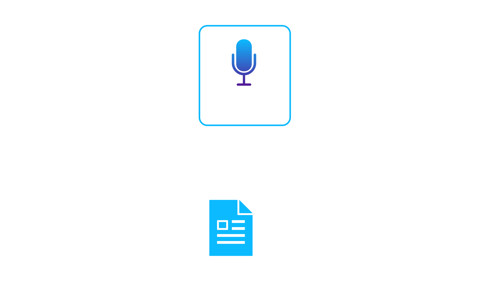

# Contract Generation

Although Signet treats the provider's API spec as the authoritative document, the framework also uses consumer contracts as an internal representation of the consumer's implementation.
Both document types consist of serialized data (JSON or YAML) and can be written using a text editor.
It is common to manually write API specs while initially designing an API, but it is less common to write consumer contracts by hand.
Instead, many frameworks use dedicated unit tests that generate the consumer contract from the consumer service's client code.
In either case, the goal is to test that the consumer service's expectations adhere to the provider's API spec.
While we have already discussed how Signet does this on the provider's side through provider verification, we now need to tackle the same challenge on the consumer side.

## Tedious Approaches

It did not take us long to rule out the option of writing consumer contracts by hand.
While writing an API spec by hand is beneficial in the context of spec-driven API design, there is little practical benefit to creating a consumer contract this way.
The provider's API spec acts as a "blueprint" for the integration, but the consumer contract only serves as a "snapshot" of the consumer's implementation.
Since the consumer contract is only meant to represent the consumer's implementation, it makes more sense to generate it automatically.

We also considered the possibility of providing a client library so that consumer teams could generate the consumer contract from dedicated unit tests.
This is the way that many existing solutions create consumer contracts and have the benefit of being self-sufficient.
Teams can write unit tests specifically for contract testing, and these are effective even when run in isolation from other forms of testing.

As discussed in previous sections, the major drawback here is that writing unit tests to generate a consumer contract is very labor intensive.
It requires a unit test for every interaction that the consumer has with the provider.
It also requires consumer teams to learn a new library.

For these reasons, we decided to implement a way to generate the consumer contract from the consumer team's existing service tests.

## Leveraging Service Tests

The motivation behind this approach is to leverage existing information to generate the consumer contract.
We assume that teams have configured a mocking service for their service tests.
If that’s the case, the mocking service configuration should contain descriptions of the expected HTTP requests and responses between the consumer and provider.
Signet extracts this information to generate the consumer contract.

We considered two extraction methods, which we refer to as *recording* and *reading*, and although both can coexist, we decided only to implement recording.

### Recording

Signet offers a **passthrough proxy** that sits between the consumer and mock provider server to record all HTTP requests and responses during the service tests.
After the tests finish, we can use the recorded data to generate a consumer contract.

The benefit of this approach is that it is not code-invasive and is compatible with any HTTP mocking service, allowing easy integration into an existing system.
However, a notable drawback of this method is that the consumer contract can only be generated and published *after* the service tests finish executing, which results in delayed feedback on contract comparison.

### Reading

This approach would have involved reading the mock service configuration files to extract the expected HTTP requests and responses.
We could have then used the extracted data to generate the consumer contract.

One advantage of this approach is that a proxy would no longer be necessary, requiring one less component.
Also, since there is no recording, we could generate the consumer contract without executing the service tests.

The main disadvantage is that the format of the HTTP request and response definitions would differ depending on the mocking service, requiring us to implement individual support for each service.
As one of our goals was to maximize Signet's compatibility with existing infrastructure, we decided that we would focus on implementing recording as the primary approach.
