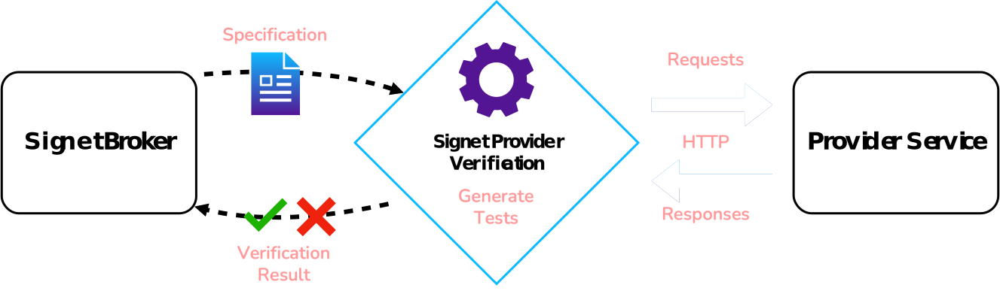

# Provider Verification

## Trust, but Verify

Consider a situation where the published consumer contract and provider specification are compatible, but the provider service does not fully implement the requirements defined in their specification.
In this case, even though the consumer service conforms to the API spec, its integration with the provider service might break when the two services are deployed together.
For Deploy Guard to catch this issue, there needs to be a way to verify that the provider service faithfully implements its specification.

## Verification Responsibility

Some existing solutions have first-class support for provider verification, while others leave it up to the developer to plug in their preferred tools.
Shifting the responsibility to developers is attractive in some ways because it gives them the flexibility to employ their preferred testing tools.
After a successful test, they can still publish the results to the broker to show that the provider correctly implements the spec.

Besides the fact that this approach requires more work for the developer, there is an additional risk that the tests may not cover all of the requirements in the latest specification.
The broker is essentially trusting the provider team to implement their tests correctly since it only sees the test results and not the tests themselves.

After weighing these trade-offs, we decided to offer provider verification out of the box.
By letting Signet take responsibility for the integrity of the test, we aim to make it as simple as possible for developers to get the safety that verification offers.

## Approaches to Verification

Having decided to include provider testing, we then considered a few options on how to implement it.
The approach we settled on is centered around *black box testing*.

### Black Box Testing

*Black box testing* is a testing technique in which the code and implementation details of the tested software are unexposed to the tester.
We achieved this by simulating a mock consumer that utilizes the OpenAPI Specification to send requests to the provider.

The mock consumer sends a request to the provider for each described request in the specification.
If all the provider responses satisfy the requirements of the specification, then the provider is verified.
The main benefit of this approach is that it can be run from the command line and is *language agnostic*.

### Alternatives

During our design phase we also considered a couple of alternative approaches to provider verification.

#### Generate Unit Tests from the Specification

The first was to *generate unit tests automatically* from the OpenAPI Specification; the provider is verified if they pass the generated unit tests.
The main advantage of this approach is its convenience in a new codebase, as it automates the process of writing some of the provider’s unit tests.

However, the code-invasive nature of this approach entails a few downsides.
First, integrating our feature with existing testing frameworks would be problematic, as it would require developing individual support for each framework.
Second, we would also need a way to ensure synchronization between unit tests and specifications, otherwise developers can unintentionally modify the unit tests in a way that inaccurately tests the specification.

Considering these issues, we decided that supporting this approach would be outside the current scope of Signet.

#### Generate OpenAPI Specification from Code

A second approach that we considered involves *generating an additional OpenAPI specification* directly from the provider code.
We could then compare the generated specification with the published one to verify the provider’s implementation.
While this approach is well-suited for an existing codebase, the implementation would be complicated because tools for API spec generation tend to be tightly coupled to server frameworks.
As such, this approach would also require implementing individual support for each framework, which we considered impractical.
