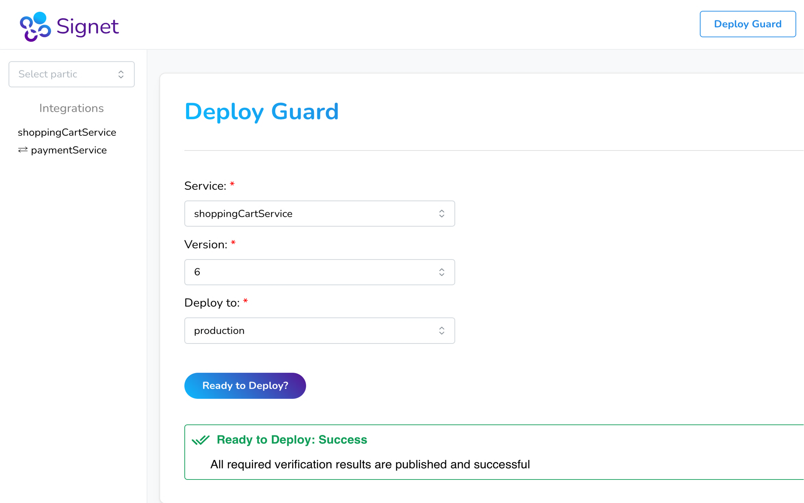
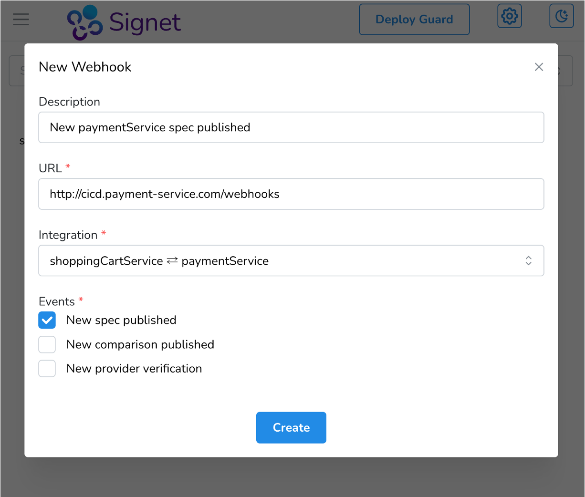

# Introducing Signet

**Signet** is an open-source, self-hosted framework for spec-driven contract testing of microservices.

It is designed for companies that are experiencing the pain points of integration and E2E testing, and want an easy way to introduce contract testing.
Companies with existing service tests don't need to write any new unit tests, and provider verification is supported as a first-class feature.
Signet is also deployment-aware, so teams can easily check if their service is safe to deploy to an environment.
Signet can be fully integrated with CI/CD in order to automate contract testing and reduce the need for more expensive tests.

## Core Features

### Spec-driven Approach

<!-- A core value of Signet is maximizing the independent deployability of services.
For that reason, Signet uses a spec-driven approach to contract testing, where the details of the integration are defined first in an API spec.
Establishing the contract ahead of time enables parallel development, where multiple teams can work concurrently on different microservices.
By ensuring that each service aligns with the expected specifications, this approach accelerates the overall development process, enabling companies to rapidly deliver new features and updates. -->

Signet uses a spec-driven approach to contract testing in order to maximize the independent deployability of services.
The authoritative contract is an OpenAPI spec which both the consumer and provider services are responsible to conform to.
Once the spec is published to the Signet broker, both services can be implemented in parallel and tested independently.
The consumer team uses a consumer contract to represent the behavior of the consumer, and this contract is compared with the API spec to test the consumer's side of the integration.
The provider team tests the implementation of the provider service directly against the API spec.

### Self-hosted

Signet is an open source framework that is intended to be self-hosted by the companies which use it.
It does not provide a managed option that will abstract away deployment, scaling, or high availability.
With those qualifications, Signet does provide two deployment strategies aimed at making it simple to self-host.
For companies that already use AWS, the `signet deploy` CLI command provisions an ECS Fargate cluster and deploys the Signet broker along with all supporting infrastructure.
An admin only needs their IAM credentials to deploy the broker to their existing AWS cloud.
For companies using other cloud providers or hosting on premises, Signet provides a docker compose file to make it as simple as possible for them to get going.

### Easy to Adopt
<!-- 
One of Signet's key strengths lies in its ease of adoption.
It offers the ability to leverage existing service tests to **automatically generate the consumer contract**.
This saves companies from the time-consuming and error-prone processes of writing new unit tests to get started with contract testing.

Signet also offers built-in support for **provider verification**.
While some spec-driven solutions require companies to wire up their own tool, Signet offers this feature out of the box.
Signet uses the API spec to generate tests that verify that the provider correctly implements the spec.

Moreover, organizations can deploy the Signet broker to their existing AWS cloud with a single command.
The Signet CLI provisions an ECS Fargate cluster along with all of the necessary supporting infrastructure.
This deployment strategy makes it simple to set up Signet and scale its capacity as needed. -->

Once a company is hosting the broker, Signet offers two features that reduce the typical startup costs associated with contract testing.
For consumer teams, the CLI offers the ability to record existing service tests in order to generate the consumer contract.
This eliminates the need for developers to write a new tests in order to adopt contract testing.

Signet also offers built-in support for provider verification.
After a provider team has implemented their service, Signet can generate tests based on the API spec.
These tests are executed against the provider service in order to verify that it correctly implements the spec.

### Dedicated Broker

Rather than storing contracts in version control, Signet uses a broker to implement deployment-awareness and CI/CD integration.

<!-- Testing that a service satisfies a contract is not enough by itself.
What developers really care about is whether anything will break when a new service version is deployed to an environment.
This requires the additional step of identifying the current set of relevant contracts, a potentially onerous task that most solutions leave up to the developer.

Signet's **Deploy Guard** feature tracks the deployment of service versions, making it easy to see if a new service is safe to deploy.
It verifies the presence and compatibility of all of the service's providers in the environment.
It also ensures that the service won't break any of the consumers that rely on it.

Signet's broker also **integrates with CI/CD pipelines** through webhooks and the Signet CLI.
CI/CD pipelines can subscribe to receive webhooks from the Signet broker, allowing them to respond to new contract testing events.
Additionally, the contract testing workflow can be fully automated through the Signet CLI, enabling CI/CD pipelines to gate deployments if they would introduce breaking changes. -->

Signet offers deployment-awareness through a feature called **Deploy Guard** which keeps track of deployments in each environment.
When a developer wants to know if it is safe to deploy a new version of a service, Deploy Guard uses deployment data to identify the relevant set of contracts.
Given these, Deploy Guard can check whether:
- The service is compatible with all of its consumers which are deployed in the environment.
- All of the service's providers are deployed in the environment.
- All of the service's providers are compatible with the service.

If all of these conditions are met, Deploy Guard informs the developer that it is safe to deploy to that environment.

Deploy Guard is also available through the Signet CLI, allowing CI/CD pipelines to gate deployments based on what is already deployed.
Along with Deploy Guard, the rest of the contract testing workflow can be automated in CI/CD using the CLI.
The Signet broker ensures that there is a centralized source of truth for every pipeline implementing contract testing.
Event-driven workflows are also supported by subscribing CI/CD pipelines to recieve webhooks from the broker based on various contract testing events.

