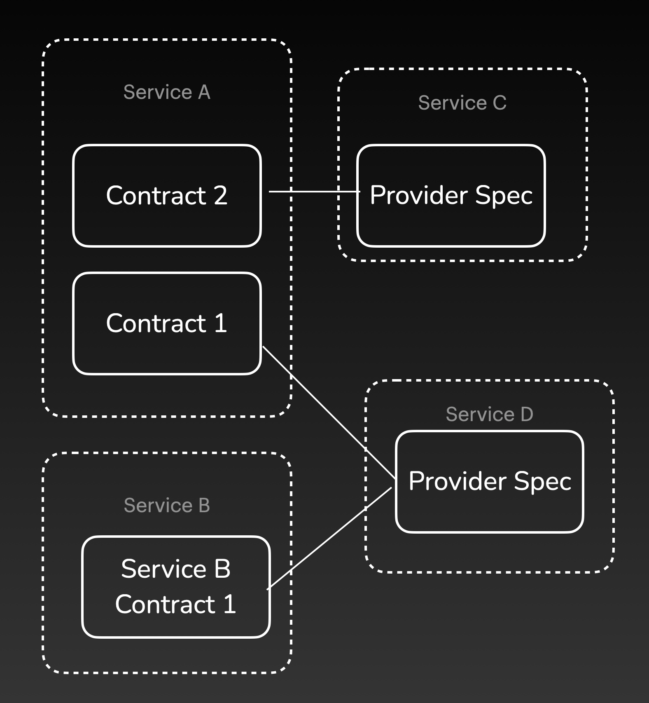
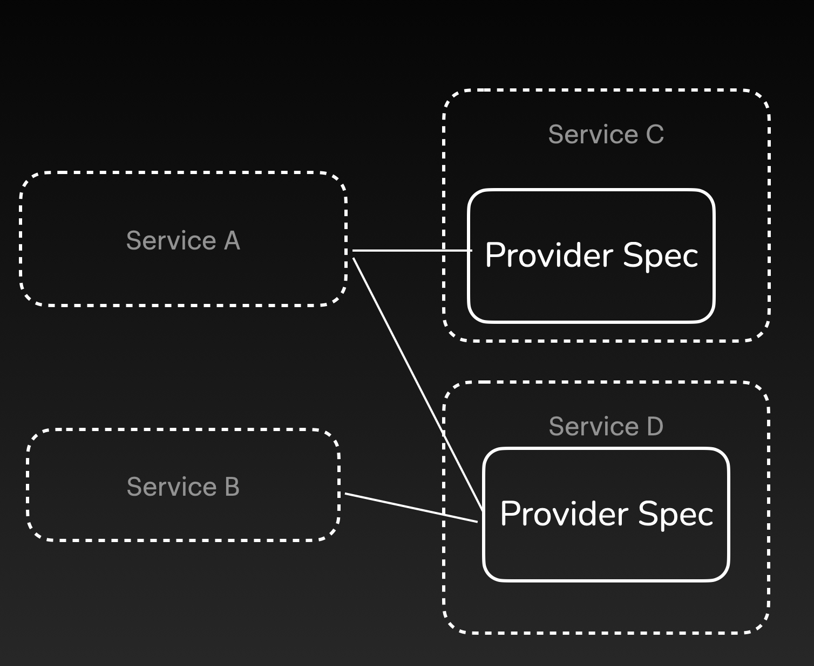

# Contract Cardinality

## Signet's Model

Signet requires two distinct document types for each integration: a *consumer contract* and a *provider specification*.

A **consumer contract** represents the API behavior that the consumer expects from a specific provider.
If a consumer relies on multiple providers, each consumer contract describes a subset of all the API behaviors required by that consumer.

On the other hand, a **provider specification** encapsulates the complete API behavior for a specific provider.
If a provider serves multiple consumers, they would all be associated with the same specification.

For every consumer, we require a *new* consumer contract for *each* associated provider.
Conversely, for each provider, only a *single* provider specification is needed to cover *all* associated consumers.

[NTD: these are rough placeholder diagrams]

## Alternative Approaches

### No Consumer Contract

 [Spec-driven contract testing](/case-study/contract_testing#spec-driven) can be performed without a consumer contract.
 In this approach, developers exclusively work with provider specifications.
 The consumer's responsibility is solely to ensure their implementation adheres to the specification, without concerning themselves with generating or publishing contracts.

 

 However, this simplicity comes at the cost of **weaker backward compatibility testing**, as it becomes challenging to detect if a new specification remains compatible with existing consumers.
 When working solely with specifications, backwards compatibility testing is limited to checking if the new specification is a superset of the old specification.

 As a result, the backwards compatibility test would fail even if a new specification removes API behaviors that none of the consumers require.
 In such cases, consumers must manually verify compatibility with the new specification.

 On the other hand, with a consumer contract, we gain precise information about which API behaviors each consumer is utilizing, enabling us to determine if the removed behavior breaks dependencies.

### One Provider Specification for Each Consumer

In this approach, developers create a **new provider specification for each associated consumer**.
Each provider specification represents all the API behaviors offered to a specific consumer.
The main advantage of this approach is its support for more flexible independent deployment.

Consider a scenario where one provider is depended on by five consumers, but the provider has only implemented the requirements for four of them.
If there were only one specification, the provider would fail provider verification and be unable to be deployed alongside any of the four consumers, even though they are all compatible.

However, with one specification per consumer, the provider would pass provider verification for each of the four consumers, enabling the deployment of all compatible services.
This scenario occurs less frequently in microservice architectures with high granularity, as in a fine-grained system, there would be significant overlap in what the consumers require from the provider.

The main downside of this approach is duplication across multiple specifications.
As we now have multiple sources of truth, inconsistencies in API descriptions may arise between specifications.
Furthermore, developers must publish a new specification each time a consumer requests additional functionality, even if the provider has already implemented it.
This is a consequence of the specification lacking awareness of the entire API interface of the provider.
